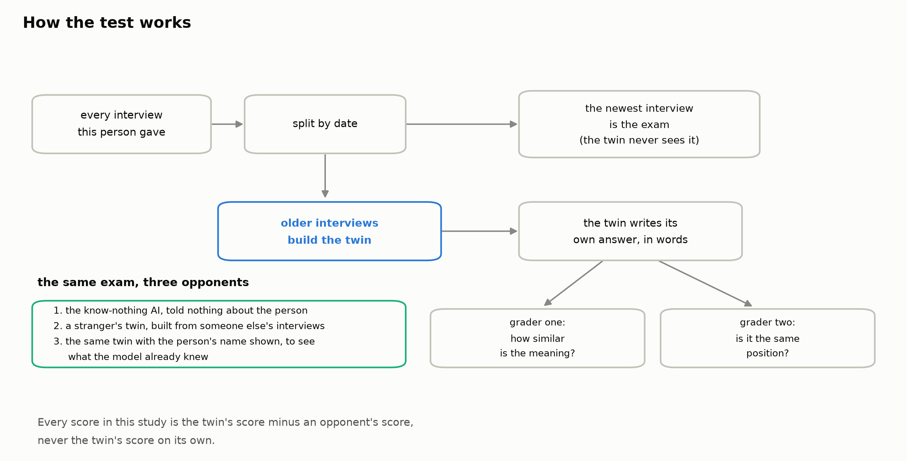
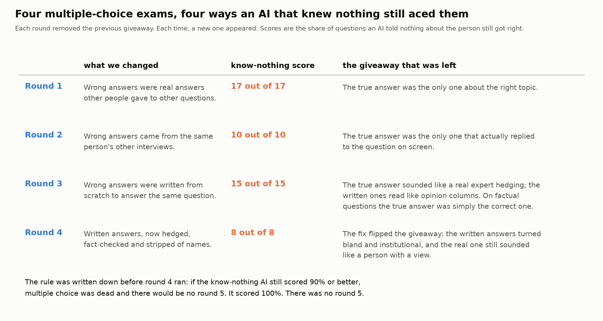
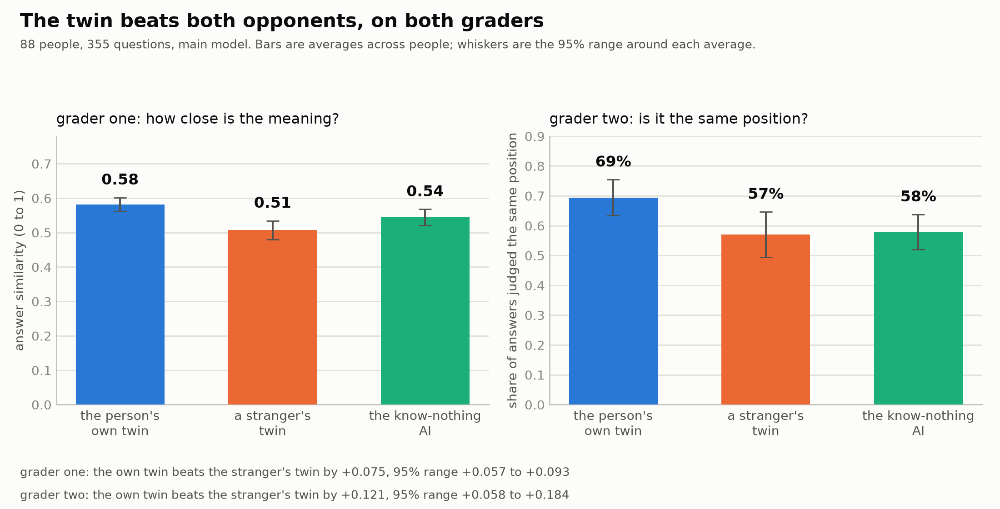
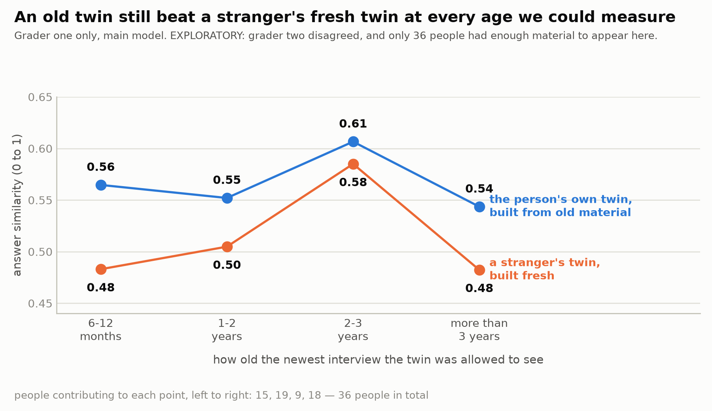
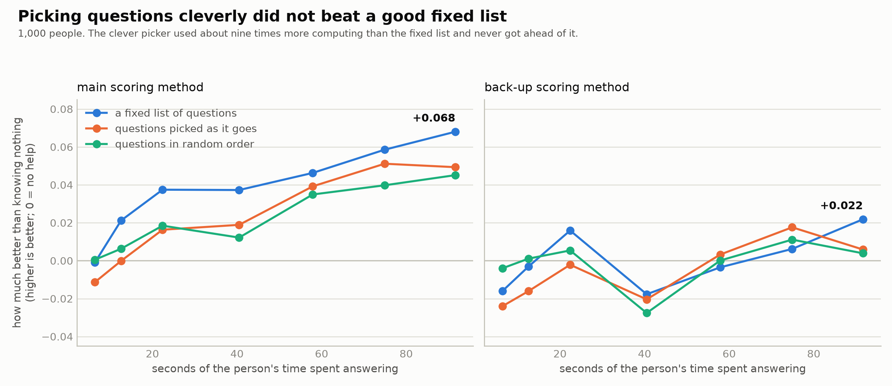

# Can an AI learn to answer like you, just by reading your old interviews?

*The readable version of Project DOPPLER. Two technical papers sit beside this one
([the results paper](PAPER2_MAIN.md) and [the methods paper](PAPER1_METHODS.md)); this
document does not replace them. Every number here is traced back to a committed report in the
appendix at the end.*

---

## 1. The question

Suppose you have been interviewed on the radio a dozen times over ten years. Could a computer
program read those old interviews and then answer a brand-new question the way you actually
would?

That is what a "twin" means here: an AI that has been shown a stack of one person's past
interviews and is then asked to reply as that person. People are already building things like
this — for market research, for polling, for practice interviews. The claims made for them
are often about accuracy: *the twin got 85% of the answers right*.

The harder question, and the one this project is about, is: **how would you check?**

A raw accuracy score tells you almost nothing on its own. If a twin gets 85% of questions
right, but a computer that has never heard of the person also gets 82% right, then the twin is
worth three points, not eighty-five. Almost everything interesting is in the comparison, not
in the score.

So the rule this project ran on, from the first day, was: **never report what a twin scored.
Only report what it scored *more than* something else.** That "something else" is doing all
the work, and most of this article is about getting it right.

---

## 2. How we tested it

### The people

We needed people who had been interviewed many times, in public, over years. Public radio and
TV interview archives are ideal: a large public collection called MediaSum — 463,596 NPR and
CNN interview transcripts from 2000 to 2020. Filtering it for people who appear at least three
separate times, months apart, with real substance each time, left 578 usable candidates — mostly expert
guests being asked to explain something. Of those, 137 have no encyclopedia page under any
spelling we could find. That was deliberate: famous people are exactly the people a large AI
model may already know, which would let it cheat.

The final test ran on **88 people and 355 questions**.

Nobody is named in this article. Everything used is words these people chose to say out loud
on national broadcast — already published, already archived. Nothing private, and nothing was
collected from anyone for this study.

### The split

For each person, we sorted their interviews by date. The **older** ones were handed to the
twin as its reading material. The **newest** one was sealed and used as the exam — the twin
never saw it. Then we took real questions a real interviewer had actually asked that person in
that sealed interview, and asked the twin to answer them.

### The three opponents

The twin's score means nothing on its own, so every twin ran against three opponents, all on
exactly the same questions, with exactly the same word limits.



*The whole test in one picture: a person's interviews are split by date, the older ones build the twin, the newest one is the sealed exam, and every score is a gap against one of three opponents.*

**Opponent one — the know-nothing AI.** The same AI model, given the same question, told
nothing whatsoever about the person. This is the floor. Anything a twin scores above this is
the value of having read the person's interviews.

**Opponent two — a stranger's twin.** This is the sharper test. We built a twin the exact
same way, at the exact same size, from *someone else's* interviews — a different person
working in the same field. If the "twin" is really just producing generic expert talk, this
imposter will score just as well. Beating a stranger's twin is the difference between
*knowing about people like this* and *knowing about this person*.

**Opponent three — the named-versus-anonymous check.** We ran every question twice: once with
the person's name hidden, once with it shown. If the model already knew the person from its
training, showing the name should improve its answers even with no interviews attached. It
did, slightly: showing the name lifted the know-nothing AI's score by **+0.013** on the main
model and **+0.050** on the second one. Both are real, both are small, and both are *measured
rather than assumed*. One check went against the obvious story: the nine people the model
seemed to recognise most had a *larger* twin advantage than everyone else, not a smaller
one — though that is nine people and a comparison made after the fact, so it settles nothing.

---

## 3. The graveyard: four exams that failed

Before any of this worked, four exam designs died. They get as much room here as the results
do, on purpose: they are the more useful part.

The original plan was multiple choice: show the twin the real question and four possible
answers, one of which is what the person actually said. Easy to score, easy to compare.

Before trusting it, we ran a check that anyone publishing a twin accuracy number should run:
**give the same multiple-choice exam to an AI that has been told nothing at all about the
person.** If that AI can pass, the exam is not measuring knowledge of the person. It is
measuring something else.

It passed. Four times, four different ways.



*Four attempts at a multiple-choice exam. Each one removed the previous giveaway, and each time a new giveaway appeared — so an AI told nothing about the person still scored 100%.*

**Round 1.** The wrong answers were real things *other people* had said in *other* interviews.
The know-nothing AI got 17 out of 17. Reason: only one of the four options was even about the
right subject. You do not need to know a person to notice that three of the options are about
completely different topics from the one the interviewer asked about.

**Round 2.** So we took the wrong answers from the *same person's* other interviews. Same
speaker, same voice, same career. Still 10 out of 10. Reason: a real answer *replies to the
question it was asked*. Put it beside three real answers to different questions, and the true
one is the only one that fits. The AI said so in its own reasoning.

**Round 3.** So we stopped harvesting and started writing: three plausible wrong answers,
written from scratch, each one answering the *same* question but taking a conflicting
position. Still 15 out of 15. And the reason was uncomfortable. The AI could tell that the
real answer was *written by a real person*. Real interviewees hedge, qualify, and say "the
evidence is mixed". The generated alternatives read like opinion columns. On top of that, when
the question had a factual answer, the true reply was simply the one that was *correct about
the world* — every genuinely conflicting alternative had to be wrong about the world.

**Round 4.** So we fixed all of that: the wrong answers were now written to hedge, fact-checked
so none was false, stripped of the host's name, and used only on opinion-type questions where
there is no single correct answer. Still 8 out of 8. And this time the fix had **inverted** the
giveaway: pushed away from sounding like an opinion column, the written answers became bland
and institutional — full of departments and committees — while the real answer still sounded
like a person with a view, using phrases like *"an absolute free ride"*.

Before round 4 ran, we wrote down a rule and committed it: **if the know-nothing AI still
scores 90% or better, multiple choice is dead on this material and there is no round 5.** It
scored 100%. There was no round 5. That rule mattered because after three near-misses the
temptation to try one more patch is enormous, and the rule was written when we could not yet
know whether it would be convenient.

One more result from that round belongs here. A frontier AI, shown only the four options and
told nothing about the speaker, picked the real answer **10 times out of 10** (random guessing
gets 2.5). The signal that gives the game away is "this text was written by a human being" —
which has nothing to do with knowing *which* human being.

**Why this should matter to you.** If you ever read that an AI twin is 85% accurate on
multiple-choice questions, the first thing to ask is what an AI knowing nothing about the
person scored on the same questions. On this material, the answer was: everything.

---

## 4. The exam that worked

The replacement is simpler and harder to fake. **The twin writes its own answer, in its own
words, to the real question.** No options, so there is nothing to eliminate.

That creates a scoring problem: how do you mark a free-text answer? We used two graders that
fail in different ways, and required both.

**Grader one measures meaning.** A small, fixed, locally-run program converts both the twin's
answer and the real answer into numbers and reports how close they are — a score from 0
("nothing in common") to 1 ("identical"). It is mechanical, it is the same program every time,
and it was pinned to one exact version before the run.

**Grader two measures position.** A separate AI reads the twin's answer and the real answer
and says whether they take the **same position**, a **different** one, or whether it **cannot
tell**. That last option matters: answers that dodge get set aside rather than counted as
wrong.

Both graders have biases. They may reward long answers, or answers on popular topics. That is
exactly why **every headline number in this project is a gap, not a score.** The twin and the
stranger's twin were graded by the same grader, in the same way, on the same questions — so
whatever the grader is unfairly generous about, it is generous about for both, and it cancels
when you subtract.

### We audited the AI grader, and the first audit failed

An AI grading an AI needs checking. So a bar was written down *before* any measurement existed:
the grader passes only if it agrees with an independent rubric-briefed auditor on at least
**80%** of a fresh, sealed set of answers, *and* clears a second statistic that discounts
agreement you would get by luck.

**The first attempt failed: 78% agreement, and the luck-adjusted score came in at 0.58 against
a bar of 0.60.** Both legs missed. That verdict was applied mechanically, by a script written
before the labels existed.

We had allowed ourselves exactly **one** revision of the grading rubric, decided in advance,
plus a rule that if the revision broke more than two answers it had previously got right, we
would stop and call it overfitted. It broke none. The revised rubric was then re-tested on a
**completely fresh** sealed set: **89% agreement, luck-adjusted 0.80 — a pass, against a bar
that never moved.**

Three things stay attached to that pass rather than being cleared by it. The auditors were AI
systems from a different model family, not people — the human check was waived, and that is
recorded as an open deviation, not a satisfied requirement. Three known hard cases are still
graded wrong. And the supply of unused development material was nearly exhausted, so the final
test set was not perfectly balanced.

---

## 5. Results, honestly

### The twin wins



*The main result: on both graders, a person's own twin scores above a stranger's twin and above an AI told nothing about them.*

On the position grader, the twin took **the same position as the real person on about 69% of
questions**. The stranger's twin managed about **57%**, and the know-nothing AI about **58%**.
The gap between the twin and the stranger's twin is **about 12 percentage points**, and the
95% range around that gap runs from about 6 to about 18 points — comfortably clear of zero.

On the meaning grader, the twin scored **0.58** against the stranger's twin's **0.51** — a gap
of **0.075**, with a 95% range of 0.057 to 0.093.

This held on both graders and on both AI models we tried. 72 of the 88 people had a twin that
beat their stranger's twin on the meaning grader. That is the headline, and it is the
part of this project that was tested against a bar frozen in advance.

**One number in that picture is strange and worth staring at.** On the meaning grader, the
know-nothing AI (0.54) scored *higher* than the stranger's twin (0.51). Being told nothing
beat being told about the wrong person. A confident, coherent profile of somebody else does
not act like harmless noise — it actively drags the answer away. An earlier, separate
experiment on survey data showed the same shape, though the stranger there was a random person
rather than someone in the same field, so it rhymes rather than repeats.

### The bar we missed, stated plainly

Before the data existed, we also froze a rule about *size*: a gap only counts as interesting
if it reaches at least **+0.05** on the meaning grader.

**The twin's gap over the know-nothing AI, on the main model, on the meaning grader, is
+0.038. That misses the +0.05 line.** It is a real gap — the 95% range is 0.021 to 0.055 and
does not touch zero — but it is smaller than what we said in advance we would call
interesting. The gap over the *stranger's* twin (+0.075) does clear that line, and the gap
over the know-nothing AI clears it on the second model (+0.058). We report all of them, and we
do not get to pick.

### The staleness surprise — exploratory

Does a twin go out of date? We rebuilt twins using only material older than a given cutoff —
same amount of reading, just older — and checked whether they got worse as the material aged.



*Exploratory, and the second grader disagreed: on the meaning grader, a twin built from years-old material still stayed ahead of a stranger's freshly built twin at every age we could measure.*

**On the meaning grader, a twin built only from interviews more than three years old still
scored above a stranger's freshly built twin.** Not just in the oldest band — in every band we
could measure, including material averaging nearly five years old.

**This whole analysis is exploratory, and that word belongs in the sentence itself rather than
in a footnote at the bottom.** Only 36 people had enough material spread across enough years to
appear on that chart at all.

**And the second grader disagreed.** On the position grader, twins built from *older* material
scored measurably *better*, not worse — a direction nobody had written down in advance as a
possible outcome — and in the shortest-age band the stranger's fresh twin came out ahead, which
never happens on the meaning grader. When the two graders point different ways, the project's
own frozen rule says no headline may be claimed at all. So **there is no staleness finding
here.** The disagreement is the reportable fact, and this section is what reporting it looks
like.

### Depth versus breadth: we could not answer it

One question we set out to answer was whether material where the interviewer *drilled into* a
topic is worth more, word for word, than material that skims across many topics.

**It came back unanswerable at full scale.** To test it fairly, a person needs enough of *both*
kinds of material to fill the same word budget twice. Only **24 of 88 people** did — development
work had suggested roughly two thirds would. Below 30 people, our own frozen rules forbid
making any claim, so no claim is made.

Worse, when we halved the word budget as a sanity check, the direction **flipped sign**. A
result that changes direction depending on how much text you feed it is not a finding. What
this run actually established is that the experiment, as designed, does not fit this kind of
material. That is worth knowing, and it is not an effect estimate.

### Clever questioning did not beat a good fixed list

A separate, earlier experiment asked a different question: if you can only ask a person a few
questions before predicting something else about them, does it help to *choose* the questions
adaptively — letting the model pick whatever it is most unsure about next?



*Measured in seconds of a real person's attention: letting the model choose its own questions never got ahead of a fixed list worked out once from population data.*

**No.** Adaptive picking beat random ordering by +0.004, with a 95% range from −0.006 to
+0.014 — indistinguishable from nothing. And this was not a case of too few people: with 1,000
people, an effect the size seen in early testing would have shown up with better than 95%
certainty. It simply was not there.

Meanwhile a **fixed** list — one order of questions, worked out once from a different group of
2,000 people, with no AI involved — beat both. By the twentieth question it was ahead of
adaptive picking by 0.019, and it was the only method whose advantage survived the back-up
scoring method.

The cost side is a result too. Adaptive picking made **twelve times** as many model calls and
used about **nine times** as much computing to end up slightly *worse*. And there is a cost the
chart cannot show: an adaptive interviewer makes the person sit and wait while it decides what
to ask next. A fixed list never does.

The horizontal axis is in seconds of a real person's attention, not question counts: twenty
questions is about 92 seconds of somebody's time.

**One scope limit, and it is binding.** This does not show that adaptive interviewing does not
work. It shows that *adaptive selection from a fixed pool of rating-scale questions did not
beat a well-chosen fixed order, at budgets up to twenty questions, on one dataset*. Whether
adaptivity helps in real open conversation is untested and remains this project's open
question.

### The twins do not know when they are wrong

We wanted to know whether a twin's own confidence is worth anything: when it is sure, is it
more often right?

The confidence measure we had originally written down could not be computed without spending
far more than we had allowed ourselves, so we substituted a different one and reported it as a
different thing rather than as the one we had promised.

The result, labelled exploratory: **the confidence signals available on these answers do not
rank the twin's right answers above its wrong ones.** The measure here is: pick one right
answer and one wrong answer at random — how often is the right one the more confident? A
useless signal scores 0.5, a perfect one scores 1.0. The best signal we had scored **0.518**.
The only signal a working twin could actually compute about itself scored **0.427 — worse than
a coin toss.** A twin that ignored the question and always stated the overall pass rate would
have done better.

So: these twins are somewhat better than nothing at answering, and no better than chance at
knowing which of their answers to trust.

---

## 6. The rules that kept us honest

None of this is unusual practice; it just is not always done, so here is each rule in plain
terms.

**Freezing the bars before the data.** Before running the real test, we wrote down exactly what
would count as success — which comparison, which size, which threshold — and committed those
documents so their contents and dates could be checked later. The reason is simple: once you
have seen the results, it is remarkably easy to convince yourself that the bar you *would*
have set is the one the data just cleared. Writing it down first removes the choice. It is why
the missed +0.05 bar in section 5 is in this article at all.

**Kill rules.** A kill rule is a promise, made in advance, to stop. Ours said: if the fourth
multiple-choice design still lets a know-nothing AI score 90% or better, the whole format is
dead and there is no fifth attempt. Without that, four failures become five, then six, and
each patch feels reasonable in the moment.

**Imposter controls.** The single most useful thing in this project is the stranger's twin.
Any twin that just produces plausible expert talk will beat a blank baseline. Only an imposter
built by the identical process, from the wrong person's material, separates "sounds like
somebody" from "sounds like *this* person."

**A public timestamp.** The governing documents were deposited on the Open Science Framework
on 2026-07-28 (<https://osf.io/qz28m>, registered under the name **TWOPPLER**; DOPPLER is the
internal name for the same project). That deposit is a permanent, dated, outside-our-control
record of what we said we would do.

Being precise about it, because it is the sort of thing that gets overstated: **the deposit
came after the main test had already produced its numbers.** For the headline result it is a
retrospective receipt, and the only before-the-data evidence is the documents' own version
history and file fingerprints. For the later analyses it genuinely came first. A careful reader
should apply the weaker reading to the headline and the stronger one only to the closing work.

---

## 7. Limits, plainly

**This is about public personas, not people.** Every word in this study was said by someone
performing on national broadcast, with an audience, a house style, and often a professional
reason for being there. Nothing here tells you what these people are like in private, what
they believe, or what they would say to a friend. That was declared before any data was
collected and it is the ceiling on the entire result.

**One collection of material.** Every confirmatory number rests on one archive — MediaSum, the
NPR and CNN interviews described in section 2. Whether any of it holds for podcasts, court
testimony, workplace conversation, or a different country is untested. The project has form
here: a planned second-dataset replication
for the earlier questioning experiment was cancelled once we inspected the data and found it
could not support the test.

**Two models, both small, both from the same developer.** The main one is a Gemma model; the
second is a Gemini model. Nothing here says how a much larger model, or one built by someone
else, would behave.

**The AI grader is related to one of the things it grades.** Grader two is a Gemini model, and
so is the second of the two models being graded — different versions, same lineage. The
consequence is applied rather than merely noted: that model's own scores are treated as
secondary throughout, and only its twin-versus-stranger gap is given weight.

**The staleness analysis is underpowered.** 36 people, of whom fewer than half had enough
material to contribute a trend at all. One of its four results had a range so wide it contained
no information whatsoever, and we printed it rather than dropping it.

**Re-running the same question does not always give the same answer.** By accident, we
regenerated 72 prompts that were byte-for-byte identical to ones from the main run — same
model, same settings. Only 15 came back identical. The typical similarity score moved by about
0.014, the worst by 0.12, and 4 of the 72 position labels flipped. This is not a bug; it is how
this kind of computation behaves when the work is batched differently. It means thin slices of
data — the staleness bands, the depth-versus-breadth comparison — wobble at roughly the size of
the differences being discussed. It does not put the headline in doubt, because that noise
averages out across 88 people and the headline gap is several times larger than it.

**Nulls and misses, gathered in one place so they are not scattered:** the size bar was missed
on the comparison our own frozen text named; the staleness question got no verdict because the
graders disagreed; depth-versus-breadth ran out of eligible people and then flipped sign;
adaptive questioning failed its main bar; the confidence signals were worse than chance; and
the whole multiple-choice instrument was killed after four rounds.

---

## 8. What this cost, and why that matters

**The entire project — every experiment, every failed pilot, every re-run — spent about $13 on
paid model calls.** Under fifteen dollars. Alongside that it used a modest amount of borrowed
GPU time from a small national-computing allocation, most of it on one earlier experiment that
returned a null result.

That is the number most worth taking away, because of what it implies: the binding constraint
on this kind of work is not money or hardware. It is care. The expensive part was the design —
the stranger's-twin control, the four dead exam formats, the frozen bars, the audit that failed
and had to be redone.

Which also means this is auditable. Anyone can re-run the analysis; every figure in this
article regenerates from one committed script reading committed data files. Nobody needs a
budget to check us.

---

## Appendix: where every number comes from

Each row points to the committed report the number was read from. The technical papers
([results](PAPER2_MAIN.md), [methods](PAPER1_METHODS.md)) carry the full tables and the frozen
bars quoted word for word.

| Number in this article | Source |
|---|---|
| MediaSum: 463,596 transcripts; 578 candidates; 137 with no encyclopedia page | [`stage2_curation_report.md`](../stage2_curation_report.md) |
| 88 people, 355 questions | [`STAGE2_CONFIRM_REPORT.md`](../stage2_confirm/STAGE2_CONFIRM_REPORT.md) §2; [`report_numbers.json`](../stage2_confirm/report_numbers.json) (`cohort`) |
| Position grader: 69% / 57% / 58%; gap +0.121, range +0.058 to +0.184 | [`STAGE2_CONFIRM_REPORT.md`](../stage2_confirm/STAGE2_CONFIRM_REPORT.md) §2, §4 |
| Meaning grader: 0.58 / 0.51 / 0.54; gap +0.075, range +0.057 to +0.093 | [`STAGE2_CONFIRM_REPORT.md`](../stage2_confirm/STAGE2_CONFIRM_REPORT.md) §2, §4 |
| 72 of 88 people whose twin beat their stranger's twin (meaning grader) | [`STAGE2_CONFIRM_REPORT.md`](../stage2_confirm/STAGE2_CONFIRM_REPORT.md) §2 |
| Missed size bar: +0.038 against +0.05; +0.058 on the second model | [`STAGE2_CONFIRM_REPORT.md`](../stage2_confirm/STAGE2_CONFIRM_REPORT.md) §2 |
| Name check: +0.013 and +0.050; the nine most-recognised people | [`STAGE2_CONFIRM_REPORT.md`](../stage2_confirm/STAGE2_CONFIRM_REPORT.md) §6 |
| Staleness bands, 36 people, no crossover on the meaning grader | [`STAGE2_CONFIRM_REPORT.md`](../stage2_confirm/STAGE2_CONFIRM_REPORT.md) §3 |
| Graders disagree on staleness; no headline permitted | [`STAGE2_CONFIRM_REPORT.md`](../stage2_confirm/STAGE2_CONFIRM_REPORT.md) §3; [`h7_diagnostics.md`](../stage2_confirm/h7_diagnostics.md) |
| Depth vs breadth: 24 of 88 eligible; sign flips at the smaller budget | [`H6_REPORT.md`](../stage2_confirm/H6_REPORT.md) §2, §3, §8 |
| Confidence: 0.518 and 0.427 | [`H5_CALIBRATION.md`](../stage2_confirm/H5_CALIBRATION.md) |
| Round 1 — 17 of 17, topical coherence | [`PILOT_REPORT.md`](../stage2_pilot/PILOT_REPORT.md) |
| Round 2 — 10 of 10, responsiveness to the question | [`PILOT_REPORT_2.md`](../stage2_pilot2/PILOT_REPORT_2.md) |
| Round 3 — 15 of 15, speaker plausibility and world truth | [`PILOT_REPORT_3.md`](../stage2_pilot3/PILOT_REPORT_3.md) |
| Round 4 — 8 of 8, inverted register; the kill rule; the 10-of-10 frontier rater | [`PILOT_REPORT_4.md`](../stage2_pilot4/PILOT_REPORT_4.md) |
| Grader audit: 78% / 0.58 fail, then 89% / 0.80 pass on a fresh set | [`AUDIT_LINES_2026-07-28.md`](../stage2_openended/AUDIT_LINES_2026-07-28.md); [`PAPER1_METHODS.md`](PAPER1_METHODS.md) §9.4 |
| Adaptive +0.004 (range −0.006 to +0.014); fixed ahead by 0.019 at 20 questions; 12× calls, ~9× compute | [`stage1e_findings.md`](../stage1e_findings.md) |
| Twenty questions ≈ 92 seconds of a person's time | [`stage1e_timecost_note.md`](../stage1e_timecost_note.md) |
| Re-run noise: 15 of 72 identical, typical shift 0.014, 4 label flips | [`H6_REPORT.md`](../stage2_confirm/H6_REPORT.md) §11 |
| About $13 of paid model calls across the whole project | [`PAPER2_MAIN.md`](PAPER2_MAIN.md) §9 |
| Public timestamp, 2026-07-28, name TWOPPLER | [`STAGE2_CONFIRM_REPORT.md`](../stage2_confirm/STAGE2_CONFIRM_REPORT.md); <https://osf.io/qz28m> |

**Figures.** All five regenerate from one script,
[`experiments/article_figures.py`](../../experiments/article_figures.py), which reads
[`report_numbers.json`](../stage2_confirm/report_numbers.json) and
[`stage1e_confirm/analysis.json`](../stage1e_confirm/analysis.json). Two things in that script
are typed in rather than read, both with their source named in the code: the four-round summary
text, because the pilot reports are prose; and the seconds-per-question conversion, because it
derives from raw timing data that is not part of this repository. Run it with:

```
uv run --no-project --with matplotlib python experiments/article_figures.py
```

Two notes on how the figures read the data, so they cannot be over-read. The bars in the first
figure are averages across people, and their whiskers are the 95% range around each average —
the gap figures quoted underneath come from the person-by-person paired comparison in the
frozen report, which is the number the bars are there to illustrate, not a subtraction of the
two bar heights. The position-grader percentages are averaged per person and then across
people, which is how the frozen report computes them; the same rates pooled across all answers
at once run a few points higher.
